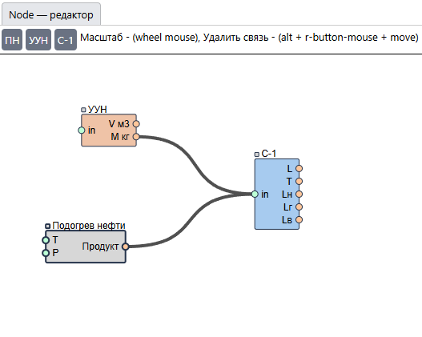

# node-editor-js
Simple Node Editor (using SVG)

Demo: [node editor](https://sozercaniekosmosa.github.io/node-editor-js/dist/)

Простой редактор "Узловых элементов"

Данный пример базируется на использовании технологии SVG
и написан на ванильном js в последствии переписан на ts и завернут в React—компонент для удобства

Упраление:
- Масштаб — mouse wheel
- Удаление связи — alt + drag mouse
- Добавление новых "Узловых элементов" из верхнего меню
- Создание связей между "Узловыми элементами"
